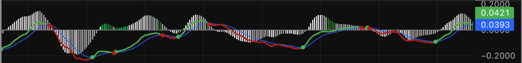
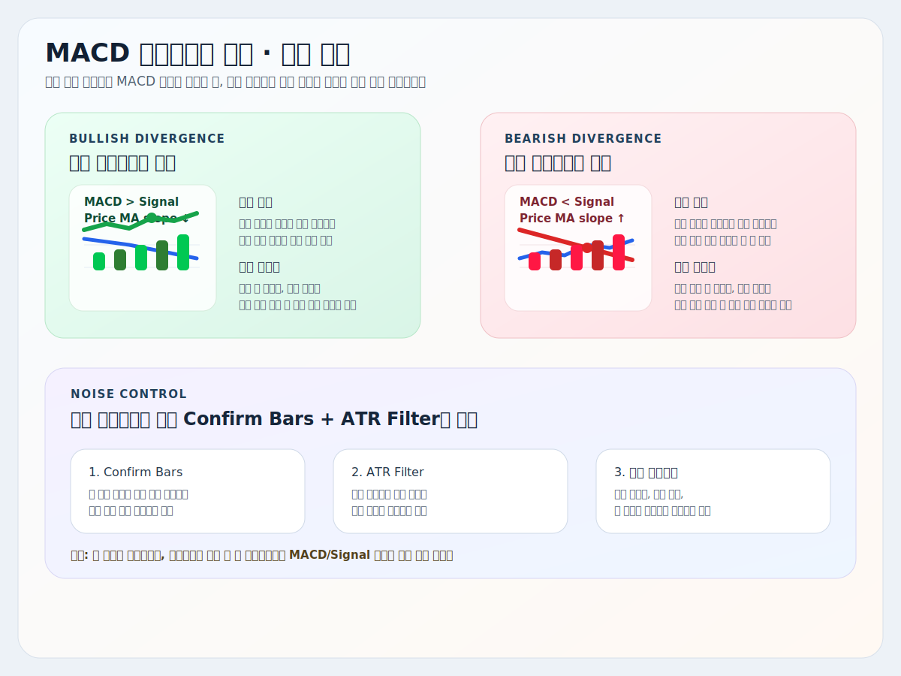
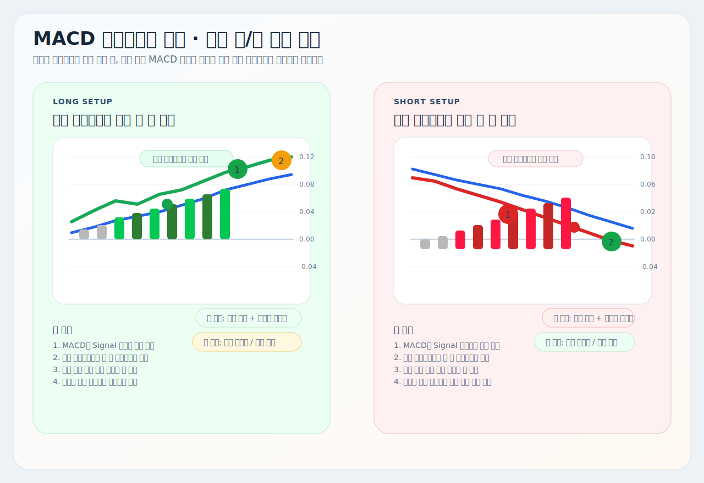

# MACD 다이버전스 추적

트레이딩뷰에서 사용할 수 있는 Pine Script 보조지표 설명서입니다.

대상 스크립트:
- [`macd-divergence-tracker.pine`](./macd-divergence-tracker.pine)

## 개요

이 지표는 기본적으로 `MACD + Signal + Histogram` 구조를 유지하면서, 히스토그램에만 `TRIX 스타일 triple EMA smoothing`을 넣어 노이즈를 줄인 버전입니다.

여기에 `가격 이동평균선 기울기`와 `MACD 방향`이 서로 어긋나는 구간만 별도 색으로 강조해서, 일반 MACD보다 `다이버전스 후보 구간`을 더 직관적으로 읽기 쉽게 만든 것이 핵심입니다.

또한 최근 버전에서는 아래 내용이 같이 들어 있습니다.

- 히스토그램 시각 배율 조절
- `Confirm Bars + ATR Filter` 기반 튐 방지
- MACD/Signal 우측 프라이스 라벨만 유지
- 시그널 크로스 원 표시

## 사용 지표

이 스크립트는 아래 요소를 조합해서 봅니다.

- `MACD`
- `Signal Line`
- `TRIX 스타일로 평탄화한 Histogram`
- `Price MA Slope`
- `ATR 기반 다이버전스 필터`

## 트레이딩뷰 적용 방법

1. 트레이딩뷰에서 `Pine Editor`를 엽니다.
2. [`macd-divergence-tracker.pine`](./macd-divergence-tracker.pine) 파일 전체를 복사합니다.
3. Pine Editor에 붙여넣습니다.
4. `차트에 추가`를 누릅니다.
5. 필요하면 저장합니다.

## 예시 화면

위 이미지에서 핵심은 아래와 같습니다.

- 흰색 / 회색 히스토그램: 일반 히스토그램 구간
- 진한 초록 / 진한 빨강 히스토그램: 다이버전스 후보 강조 구간
- 주황/녹색/빨강 MACD 선: 방향이 반영된 MACD 라인
- 파란색 선: Signal line
- 초록/빨강 원: MACD와 Signal의 크로스 지점

쉽게 줄이면:

- `선 관계`는 방향
- `히스토그램 색`은 다이버전스 후보
- `원`은 타이밍 체크

## 이미지에서 어떻게 보는지

이 지표는 `추세를 정하는 지표`라기보다, 이미 보고 있는 방향 안에서 `힘이 다시 붙는지 / 반등이 약한지`를 체크하는 용도에 가깝습니다.

먼저 보는 순서는 아래처럼 단순하게 잡으면 됩니다.

1. `MACD > Signal`인지, `MACD < Signal`인지 먼저 봅니다.
2. 그다음 히스토그램이 흰색/회색인지, 초록/빨강인지 봅니다.
3. 마지막으로 크로스 원이 나온 위치가 추세 재개 자리인지 확인합니다.

핵심 해석은 아래처럼 보면 됩니다.

- `MACD > Signal + 초록 다이버전스 히스토그램`
  - 가격 이평은 눌리는데, MACD 힘은 아직 위쪽에 있다는 뜻에 가깝습니다.
  - 눌림 흡수 뒤 재상승 후보로 해석할 수 있습니다.

- `MACD < Signal + 빨강 다이버전스 히스토그램`
  - 가격 이평은 반등하는데, MACD 힘은 아직 아래쪽이라는 뜻에 가깝습니다.
  - 반등 실패 뒤 재하락 후보로 해석할 수 있습니다.

- `흰색 / 회색 히스토그램`
  - 일반적인 모멘텀 확장/축소 구간으로 보고, 다이버전스 강조는 아니라고 해석합니다.

## 기본 정보

- Pine Script 버전: `@version=5`
- 표시 위치: 별도 패널
- 지표명: `MACD-Divergence-Tracker`
- 우측 프라이스 라벨: `MACD`, `Signal`만 표시

## 현재 기본 세팅

현재 기본값은 `노이즈를 줄인 9이평 다이버전스 감시` 기준으로 맞춰져 있습니다.

- `Fast Length`: `12`
- `Slow Length`: `26`
- `Signal Smoothing`: `9`
- `Price MA Length`: `9`
- `Histogram TRIX Smoothing`: `3`
- `Divergence Confirm Bars`: `2`
- `Divergence ATR Length`: `14`
- `Divergence ATR Filter`: `0.02`
- `Histogram Scale`: `3.0`
- `MACD Width`: `2`
- `Signal Width`: `1`
- `Circle Width`: `3`

즉 기본값은 `기존 MACD보다 히스토그램은 더 부드럽고`, `다이버전스 색은 덜 튀게`, `막대는 더 크게` 보이도록 맞춘 상태입니다.

## 주요 기능

| 기능 | 핵심 의미 | 주요 설정/조건 |
| --- | --- | --- |
| MACD / Signal | 기본 방향 판별 | `Fast`, `Slow`, `Signal Smoothing` |
| TRIX 스타일 히스토그램 | 히스토그램만 별도 평탄화 | `Histogram TRIX Smoothing` |
| 다이버전스 색상 강조 | MACD 방향과 가격 이평 방향이 어긋날 때만 색상 강조 | `Price MA Length` |
| 튐 방지 필터 | 미세한 이평 기울기 흔들림을 줄임 | `Confirm Bars`, `ATR Length`, `ATR Filter` |
| 히스토그램 시각 배율 | 막대를 더 크게 또는 작게 표시 | `Histogram Scale` |
| 시그널 크로스 원 | 골든/데드 크로스 지점을 바로 확인 | `Show Circle on Cross`, `Circle Width` |

짧게 보면:

- 선은 `방향`
- 히스토그램은 `모멘텀 압축`
- 초록/빨강 히스토그램은 `다이버전스 후보`
- 원은 `크로스 타이밍`

## 추천 사용 흐름

1. 먼저 MACD가 Signal 위인지 아래인지 확인합니다.
2. 히스토그램이 흰색/회색인지, 초록/빨강인지 봅니다.
3. 초록/빨강이 한두 봉으로 끝나는지, 몇 봉 유지되는지 봅니다.
4. 크로스 원이 같은 방향 재개 쪽에서 나오는지 확인합니다.
5. 가격 구조나 상위 추세와 같은 방향일 때만 우선순위를 높입니다.

예시:

- `MACD > Signal + 초록 히스토그램 + 초록 크로스 원`
  - 롱 쪽 힘 재개 후보

- `MACD < Signal + 빨강 히스토그램 + 빨강 크로스 원`
  - 숏 쪽 힘 재개 후보

- `히스토그램 색은 튀는데 원이 없고, 선도 애매함`
  - 아직 확인 부족 구간

## 세력 관점 해석

이 지표는 전통적인 피벗 다이버전스 확정판정보다, `평균 가격 기울기와 내부 모멘텀이 엇갈리는 구간`을 먼저 잡아내는 데 의미가 있습니다.

### 1. `MACD > Signal + 초록 다이버전스 히스토그램`

이 구간은 가격 이평이 잠깐 눌리는데도, 내부 모멘텀이 아직 위쪽이라는 뜻에 가깝습니다.

- 표면 가격은 쉬어가지만, 내부 힘은 완전히 꺾이지 않은 상태일 수 있습니다.
- 눌림 뒤 초록 막대가 유지되면 `매물 흡수 후 재상승` 가능성을 봅니다.
- 세력 관점에서는 `눌림을 이용한 추가 매집` 또는 `평균 단가 방어` 가능성을 먼저 생각할 수 있습니다.

### 2. `MACD < Signal + 빨강 다이버전스 히스토그램`

이 구간은 가격 이평이 잠깐 반등해도, 내부 모멘텀은 아직 아래쪽이라는 뜻에 가깝습니다.

- 반등이 나와도 힘이 약한 `기술적 되돌림`일 수 있습니다.
- 빨강 막대가 유지되면 `반등 매도 후 재하락` 가능성을 더 높게 봅니다.
- 세력 관점에서는 `위로 올려서 털어내는 분산` 또는 `반등 매도`를 의심할 수 있습니다.

### 3. `흰색 / 회색 히스토그램`

이 구간은 아직 다이버전스 강조 조건이 충족되지 않은 상태입니다.

- 일반 MACD 히스토그램처럼 확장/축소만 해석하면 됩니다.
- 모든 흰색/회색 구간이 의미 없는 것은 아니지만, 이 지표의 핵심 강조는 아닙니다.

### 4. 튐 방지 필터의 의미

이번 버전에서 중요한 부분이 바로 이 부분입니다.

- `Confirm Bars`
  - 이평 방향이 한 봉만 바뀌었다고 바로 색을 바꾸지 않습니다.
- `ATR Filter`
  - 이평 변화폭이 너무 작으면 방향 변화로 인정하지 않습니다.

즉 `평평한 9이평이 미세하게 흔들리는 것` 때문에 다이버전스 색이 튀는 문제를 줄이는 역할입니다.

### 5. 이 지표로 예측할 수 있는 움직임

- 초록 다이버전스 유지: 눌림 후 재상승 가능성 증가
- 빨강 다이버전스 유지: 반등 후 재하락 가능성 증가
- 초록/빨강이 짧게만 튐: 노이즈 또는 애매한 전환 가능성
- 크로스 원까지 같은 방향으로 붙음: 후속 진행 가능성 증가

## 거래 예시

### 롱 예시

- MACD가 Signal 위에 있습니다.
- 가격은 잠깐 눌리지만, 히스토그램이 초록 다이버전스로 바뀝니다.
- 이후 초록 크로스 원이 다시 나오거나, MACD가 Signal 위를 유지하면 `눌림 뒤 재상승` 시나리오를 먼저 봅니다.

### 숏 예시

- MACD가 Signal 아래에 있습니다.
- 가격은 잠깐 반등하지만, 히스토그램이 빨강 다이버전스로 바뀝니다.
- 이후 빨강 크로스 원이 다시 나오거나, MACD가 Signal 아래를 유지하면 `반등 뒤 재하락` 시나리오를 먼저 봅니다.

핵심은 `원 하나`보다 `다이버전스 색 + 선 위치 + 후속 유지`를 같이 보는 것입니다.

## 실전 롱/숏 전략 예시

### 롱 기준

- `롱 준비`: MACD가 Signal 위에 있고, 초록 다이버전스 히스토그램이 붙기 시작합니다.
- `롱 매수`: 초록 히스토그램 유지 중 첫 재상승 크로스가 나오거나, 히스토그램이 다시 확장될 때 진입을 준비합니다.
- `롱 매도`: 직전 고점 재시험 구간 또는 초록 다이버전스가 사라지고 MACD가 둔화되는 자리에서 분할 청산을 생각합니다.
- `무효화`: MACD가 Signal 아래로 다시 밀리고, 초록 구간이 바로 사라지면 시나리오를 약화시킵니다.

### 숏 기준

- `숏 준비`: MACD가 Signal 아래에 있고, 빨강 다이버전스 히스토그램이 붙기 시작합니다.
- `숏 매도`: 빨강 히스토그램 유지 중 첫 재하락 크로스가 나오거나, 히스토그램이 다시 확장될 때 진입을 준비합니다.
- `숏 매수`: 직전 저점 재시험 구간 또는 빨강 다이버전스가 사라지고 MACD가 둔화되는 자리에서 분할 청산을 생각합니다.
- `무효화`: MACD가 Signal 위로 다시 복귀하고, 빨강 구간이 바로 사라지면 시나리오를 약화시킵니다.

### 이 지표를 쓸 때 중요한 점

- 이 지표는 `단독 진입 신호기`보다 `힘 재개 확인기`에 가깝습니다.
- 크로스 원은 `타이밍`, 히스토그램 색은 `조건`, MACD/Signal 관계는 `방향`으로 보는 게 가장 단순합니다.
- `Histogram Scale`은 시각 확대용일 뿐, 실제 신호 계산을 바꾸지는 않습니다.

## 주의사항

- 여기서 말하는 다이버전스는 `클래식 피벗 다이버전스 확정판정`이 아니라, `가격 이평 기울기와 MACD 방향의 어긋남`을 강조한 방식입니다.
- 히스토그램은 triple EMA smoothing이 들어가므로, 일반 MACD보다 반응이 약간 늦을 수 있습니다.
- `ATR Filter`를 너무 높이면 초반 전환이 늦게 잡힐 수 있습니다.
- `Confirm Bars`를 너무 낮추면 다시 튀고, 너무 높이면 너무 둔해질 수 있습니다.
- `Histogram Scale`은 막대 높이만 바꿉니다. 계산 로직 자체는 바꾸지 않습니다.
- 멀티타임프레임(`Indicator TimeFrame`)을 사용할 경우, 현재 차트 봉과 계산 봉 사이의 체감이 달라질 수 있습니다.

## 한 줄 정리

이 지표는 `MACD 선으로 방향을 보고`, `히스토그램 색으로 다이버전스 후보를 보고`, `크로스 원으로 재개 타이밍을 확인하는 MACD 보강형 도구`로 쓰는 것이 가장 좋습니다.
