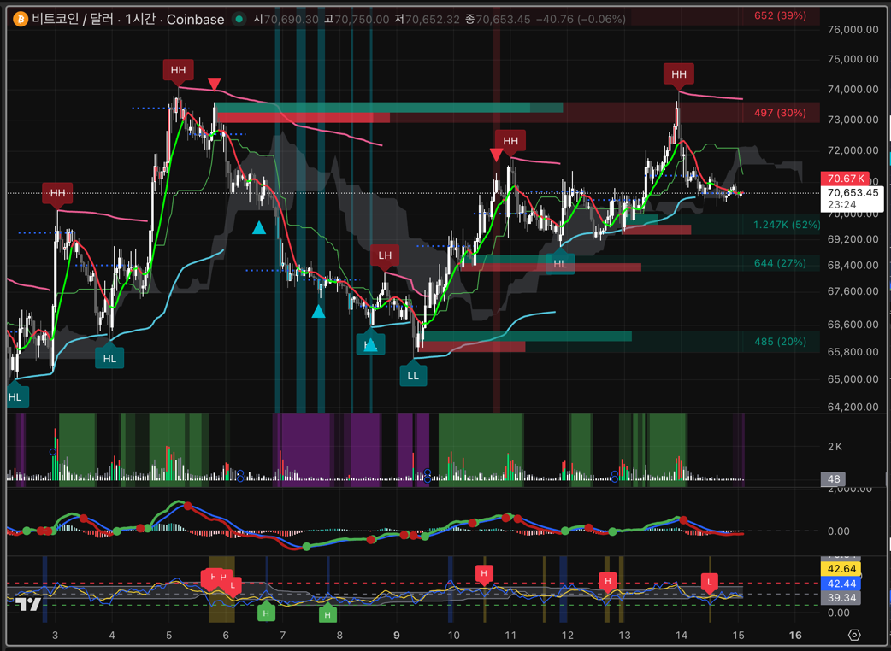

# PineScript 트레이딩 가이드

이 폴더는 여러 Pine Script 지표를 `한 장의 의사결정 흐름`으로 묶어 보기 위한 안내서입니다.

루트 README는 전체 구조를 소개하는 용도이고, 각 하위 폴더 README에는 `적용 방법`, `예시 화면`, `설정값`, `실전 해석`이 따로 정리돼 있습니다.

핵심만 먼저 보면:

- `추세`로 먼저 방향을 정합니다.
- `캔들`로 지금 자리가 눌림인지 반등 실패인지 봅니다.
- `거래량`으로 실제 압력이 붙는지 확인합니다.
- `MACD`로 내부 모멘텀이 다시 붙는지 봅니다.
- `보조 지표`로 추격 위험과 반전 위험을 마지막으로 거릅니다.

즉 한 줄로 줄이면:

- `추세`는 방향
- `캔들`은 자리
- `거래량`은 실행
- `MACD`는 힘 재개
- `보조`는 추격 위험

## 예시 화면

위 이미지에서는 여러 지표가 한 화면에 겹쳐 있습니다.

- 메인 차트: [`추세 추적`](./추세%20추적/README.md) + [`비정상 가격 추적 (캔들)`](./비정상%20가격%20추적%20(캔들)/README.md)
- 중간 거래량 패널: [`거래량 압력 추적`](./거래량%20압력%20추적/README.md)
- 하단 모멘텀 패널: [`MACD 다이버전스 추적`](./MACD/README.md)
- 맨 아래 보조 패널: [`비정상 가격 추적 (보조)`](./비정상%20가격%20추적%20(보조)/README.md)

이미지를 아주 단순하게 읽으면 아래 순서입니다.

1. 메인 차트에서 `방향`과 `기준 가격`을 먼저 봅니다.
2. 거래량 패널에서 `실제 압력`을 확인합니다.
3. MACD와 보조 패널로 `힘 재개 / 반전 위험`을 마지막에 확인합니다.

## 폴더 구성

| 폴더 | 역할 | 언제 먼저 보나 |
| --- | --- | --- |
| [`추세 추적`](./추세%20추적/README.md) | 스윙 구조, 적응형 VWAP, 일목, 정렬 배경으로 큰 방향을 정합니다. | 항상 제일 먼저 |
| [`비정상 가격 추적 (캔들)`](./비정상%20가격%20추적%20(캔들)/README.md) | 비정상 캔들, 다이버전스, ATR 배경, 진입 후보, 스윕 확인을 봅니다. | 실제 자리 확인할 때 |
| [`거래량 압력 추적`](./거래량%20압력%20추적/README.md) | 현재 봉의 매수/매도 압력과 비정상 거래량을 봅니다. | 진입 직전 압력 확인할 때 |
| [`MACD`](./MACD/README.md) | 내부 모멘텀 재가속과 다이버전스 후보를 봅니다. | 타이밍 확인할 때 |
| [`비정상 가격 추적 (보조)`](./비정상%20가격%20추적%20(보조)/README.md) | cRSI + MFI 기반 반전 위험과 추격 위험을 거릅니다. | 마지막 필터 |

## 추천 읽는 순서

실전에서는 아래 순서가 가장 단순합니다.

1. [`추세 추적`](./추세%20추적/README.md)으로 먼저 큰 방향을 정합니다.  
   `HH/HL + 강세 정렬`이면 롱 우선, `LH/LL + 약세 정렬`이면 숏 우선입니다.

2. [`비정상 가격 추적 (캔들)`](./비정상%20가격%20추적%20(캔들)/README.md)로 실제 자리를 확인합니다.  
   비정상 캔들, 다이버전스, ATR 배경, 진입 후보, 유동성 스윕이 겹치는지 봅니다.

3. [`거래량 압력 추적`](./거래량%20압력%20추적/README.md)으로 현재 봉에 실제 매수/매도 압력이 붙는지 확인합니다.  
   비정상 거래량과 평균선 상회가 같은 방향인지 봅니다.

4. [`MACD 다이버전스 추적`](./MACD/README.md)으로 내부 힘이 다시 붙는지 봅니다.  
   롱이면 초록 계열 다이버전스와 상방 구조, 숏이면 빨강 계열 다이버전스와 하방 구조를 우선 봅니다.

5. [`비정상 가격 추적 (보조)`](./비정상%20가격%20추적%20(보조)/README.md)로 반대 방향 `H / L` 위험 신호가 있는지 마지막으로 확인합니다.  
   반대 방향 강한 `H`가 보이면 추격보다 관망 쪽이 더 자연스럽습니다.

## 아주 쉬운 해석

- `롱`: 상승 추세 안에서 잠깐 눌렸다가, 거래량과 모멘텀이 다시 위쪽으로 붙는 구조
- `숏`: 하락 추세 안에서 잠깐 반등했다가, 거래량과 모멘텀이 다시 아래쪽으로 붙는 구조
- `관망`: 방향, 기준 가격, 자리, 거래량 중 하나라도 애매한 구조

초보자는 `애매하면 안 들어가는 것`이 가장 중요합니다.

## 롱 / 숏 조합 예시

### 롱 쪽으로 보기 좋은 조합

- [`추세 추적`](./추세%20추적/README.md)에서 `HH/HL` 구조와 강세 정렬이 유지됩니다.
- [`비정상 가격 추적 (캔들)`](./비정상%20가격%20추적%20(캔들)/README.md)에서 과매도성 비정상 캔들, 강세 다이버전스, 강세 ATR 배경이 겹칩니다.
- [`거래량 압력 추적`](./거래량%20압력%20추적/README.md)에서 비정상 매수 거래량이 평균선 위로 붙습니다.
- [`MACD`](./MACD/README.md)에서 초록 계열 다이버전스나 상방 재가속이 붙습니다.
- [`비정상 가격 추적 (보조)`](./비정상%20가격%20추적%20(보조)/README.md)에서 강한 반대 방향 `Bearish H`가 없습니다.

간단히 줄이면:

- `상승 추세`
- `눌림 자리`
- `매수 압력 확인`
- `MACD 힘 재개`
- `반대 위험 낮음`

### 숏 쪽으로 보기 좋은 조합

- [`추세 추적`](./추세%20추적/README.md)에서 `LH/LL` 구조와 약세 정렬이 유지됩니다.
- [`비정상 가격 추적 (캔들)`](./비정상%20가격%20추적%20(캔들)/README.md)에서 과매수성 비정상 캔들, 약세 다이버전스, 약세 ATR 배경이 겹칩니다.
- [`거래량 압력 추적`](./거래량%20압력%20추적/README.md)에서 비정상 매도 거래량이 평균선 위로 붙습니다.
- [`MACD`](./MACD/README.md)에서 빨강 계열 다이버전스나 하방 재가속이 붙습니다.
- [`비정상 가격 추적 (보조)`](./비정상%20가격%20추적%20(보조)/README.md)에서 강한 반대 방향 `Bullish H`가 없습니다.

간단히 줄이면:

- `하락 추세`
- `반등 실패 자리`
- `매도 압력 확인`
- `MACD 힘 재하락`
- `반대 위험 낮음`

## 관망해야 하는 경우

- 추세는 상승인데 캔들 구조와 거래량 반응이 약세 쪽으로 꼬여 있을 때
- 자리 신호는 좋은데 거래량이 안 붙을 때
- 거래량은 강한데 캔들 진행과 MACD 재가속이 따라오지 않을 때
- MACD가 반대 방향으로 식고 있을 때
- 보조 지표에서 강한 반대 방향 `H`가 뜰 때
- 한두 신호만 좋고 나머지가 비어 있을 때

즉 `좋은 진입을 더 찾는 것`보다 `나쁜 진입을 피하는 것`이 먼저입니다.

## 세부 설명 바로가기

- 추세 해석: [`추세 추적`](./추세%20추적/README.md)
- 캔들 자리 해석: [`비정상 가격 추적 (캔들)`](./비정상%20가격%20추적%20(캔들)/README.md)
- 거래량 압력 해석: [`거래량 압력 추적`](./거래량%20압력%20추적/README.md)
- MACD 해석: [`MACD 다이버전스 추적`](./MACD/README.md)
- 보조 반전 위험 해석: [`비정상 가격 추적 (보조)`](./비정상%20가격%20추적%20(보조)/README.md)

## 마지막 원칙

- 모르면 진입하지 않기
- 손절 자리를 먼저 정하기
- 신호 하나만 보고 진입하지 않기
- 애매하면 관망하기
- 한 봉만 보고 방향 확정이라고 단정하지 않기
- 반드시 다음 봉 유지 여부와 거래량 후속 반응까지 확인하기

돈이 걸려 있다면, `좋은 진입을 더 찾는 것`보다 `나쁜 진입을 피하는 것`이 먼저입니다.
