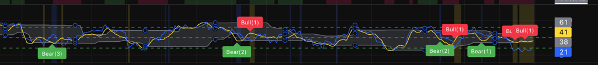

# cRSI + MFI Gap Highlight + Final Trap

트레이딩뷰에서 사용할 수 있는 Pine Script 지표 설명서입니다.

대상 스크립트:
- [`main.pine`](./main.pine)

## 개요

이 지표는 별도 패널에서 아래 내용을 한 번에 보도록 만든 보조지표입니다.

- cRSI와 MFI 동시 표시
- 최근 cRSI 분포 기반 동적 밴드
- cRSI-MFI 괴리 배경 강조
- Bull Trap / Bear Trap 라벨 표시
- 강도별 알람 조건 제공

핵심은 단순 오실레이터 2개를 같이 보여주는 데서 끝나지 않고, `괴리 발생 -> 가격/거래량/괴리 조건 점수화 -> 최종 Trap 라벨` 순서로 후보 구간을 압축해서 보여준다는 점입니다.

## 트레이딩뷰 적용 방법

1. 트레이딩뷰에서 `Pine Editor`를 엽니다.
2. [`main.pine`](./main.pine) 파일 전체를 복사합니다.
3. Pine Editor에 붙여넣습니다.
4. `차트에 추가`를 누릅니다.
5. 필요하면 저장합니다.

## 예시 화면

위 화면에서 주로 보는 것은 아래 요소입니다.

- 노란색 선: `cRSI`
- 파란색 선: `MFI`
- 회색 밴드: 최근 cRSI 분포 기반 동적 상단/하단 밴드
- 노란색 계열 배경: `cRSI > MFI` 괴리 구간
- 파란색 계열 배경: `MFI > cRSI` 괴리 구간
- `Bull(1~3)` / `Bear(1~3)` 라벨: 조건 점수에 따라 필터된 최종 Trap 신호

쉽게 해석하면:

- `배경색`은 cRSI와 MFI의 괴리 방향
- `라벨`은 그 괴리 구간 안에서 추가 조건까지 통과한 최종 후보
- `숫자`는 신호 강도

## 기본 정보

- Pine Script 버전: `@version=6`
- 표시 위치: `overlay=false`
- 지표명: `cRSI + MFI Gap Highlight + Final Trap`
- short title: `cRSI+MFI Final Trap`

## 주요 기능

### 1. cRSI 계산

- `Source`
- `cRSI Dominant Cycle`
- `cRSI Vibration`
- `cRSI Leveling %`

cRSI는 일반 RSI보다 반응이 빠르게 설정되어 있고, 최근 분포를 기준으로 상단/하단 동적 밴드가 같이 계산됩니다.

이 밴드는 고정 `80/20`선과 별개로, 현재 종목과 타임프레임에서 cRSI가 상대적으로 어디쯤 위치하는지 보는 보조 기준입니다.

### 2. MFI 계산

- `MFI Length`

MFI는 거래량이 반영된 오실레이터이기 때문에, 가격 반응 중심의 cRSI와 자금 흐름 중심의 MFI를 같이 비교할 수 있습니다.

### 3. cRSI-MFI 괴리 배경 강조

- `Show Gap Background`
- `Gap Background Threshold`
- `Gap Color (cRSI > MFI)`
- `Gap Color (MFI > cRSI)`
- `Gap Background Transparency`

조건은 단순합니다.

- `cRSI > MFI` 이고 차이가 임계값 이상이면 Bull 쪽 괴리 배경
- `MFI > cRSI` 이고 차이가 임계값 이상이면 Bear 쪽 괴리 배경

즉, 가격 모멘텀이 자금 흐름보다 앞서는지, 반대로 자금 흐름이 더 강한지를 배경색으로 바로 확인할 수 있습니다.

### 4. Bull Trap / Bear Trap 개념

트레이딩에서 `bull trap`은 겉으로는 상승 돌파나 추가 상승처럼 보이지만, 실제로는 매수 추격을 유도한 뒤 다시 밀리는 상황을 말합니다.

반대로 `bear trap`은 하락 이탈이나 추가 하락처럼 보이지만, 실제로는 매도 추격을 유도한 뒤 다시 반등하는 상황을 말합니다.

쉽게 말하면:

- `Bull Trap` = "더 오를 것처럼 보여서 롱을 붙였는데 되밀리는 구간"
- `Bear Trap` = "더 내릴 것처럼 보여서 숏을 붙였는데 되돌리는 구간"

이 지표에서는 이 개념을 `cRSI`와 `MFI`의 괴리로 해석합니다.

- `cRSI > MFI` 괴리가 크면 가격 모멘텀이 자금 흐름보다 과하게 앞선 상태로 보고, 여기서 조건이 모이면 `Bull Trap` 후보로 봅니다.
- `MFI > cRSI` 괴리가 크면 자금 흐름 대비 가격이 과하게 눌린 상태로 보고, 여기서 조건이 모이면 `Bear Trap` 후보로 봅니다.

즉, 이 문서의 `Bull Trap`과 `Bear Trap`은 전통적인 가격 패턴 이름을 그대로 쓰되, 실제 판별은 오실레이터 괴리와 보조 조건을 조합해서 수행합니다.

### 5. Final Trap 점수 계산

이 지표의 핵심 로직입니다. 배경색만으로 끝내지 않고, 아래 조건을 점수화해서 Trap 강도를 계산합니다.

- 최근 가격 방향 확인
- 평균 대비 거래량 통과 여부
- 약한 괴리 / 강한 괴리 여부
- cRSI 구간 진입 여부
- 괴리 축소 여부

관련 설정:

- `Weak Gap Threshold`
- `Strong Gap Threshold`
- `Bull Trap cRSI Zone`
- `Bear Trap cRSI Zone`
- `Volume Average Length`
- `Volume Multiplier`
- `Use Gap Fade Condition`
- `Gap Fade Lookback`

점수 해석은 아래와 같습니다.

- 3점: 약한 신호
- 4점: 중간 신호
- 5점 이상: 강한 신호

최종 라벨은 `Bull(1~3)` 또는 `Bear(1~3)` 형태로 표시됩니다.

### 6. 중복 신호 제한

같은 배경 구간에서 라벨이 계속 찍히지 않도록, Bull 배경 구간과 Bear 배경 구간마다 신호를 1회만 표시합니다.

즉:

- 새로운 Bull 괴리 배경이 시작되면 Bull 신호 가능 상태 초기화
- 새로운 Bear 괴리 배경이 시작되면 Bear 신호 가능 상태 초기화
- 같은 배경 구간 안에서는 첫 최종 신호만 표시

이 구조 덕분에 라벨이 과하게 반복되는 문제를 줄였습니다.

## 추천 사용 흐름

1. 먼저 배경색이 Bull 쪽인지 Bear 쪽인지 확인합니다.
2. 현재 cRSI가 `80/20` 근처인지, 동적 밴드 상단/하단 부근인지 봅니다.
3. 그다음 `Bull(1~3)` 또는 `Bear(1~3)` 라벨이 붙는지 확인합니다.
4. 강도 숫자가 높을수록 우선순위를 높게 봅니다.
5. 실제 진입 판단은 가격 구조, 거래량, 상위 타임프레임 방향과 함께 확인합니다.

간단히 해석하면:

- `MFI > cRSI 괴리 + Bear 라벨` = 눌림 이후 반등 후보 관찰
- `cRSI > MFI 괴리 + Bull 라벨` = 과열 이후 조정 후보 관찰
- `배경색만 있고 라벨 없음` = 조건이 덜 모인 상태

## 알람 설정 방법

이 스크립트에는 `alertcondition(...)`이 포함되어 있어서 트레이딩뷰 알람으로 바로 사용할 수 있습니다.

### 제공되는 알람 종류

- `Bull Trap`
- `Bear Trap`
- `Bull Trap (3)`
- `Bull Trap (2)`
- `Bull Trap (1)`
- `Bear Trap (3)`
- `Bear Trap (2)`
- `Bear Trap (1)`

강한 신호만 받고 싶으면 `(3)` 위주로 쓰고, 초기 후보까지 넓게 보려면 기본 알람이나 `(1)`, `(2)`를 함께 쓰면 됩니다.

## 입력값 요약

### cRSI 관련

- `Source`
- `cRSI Dominant Cycle`
- `cRSI Vibration`
- `cRSI Leveling %`

### MFI 관련

- `MFI Length`

### 선 표시 관련

- `cRSI Color`
- `MFI Color`
- `cRSI Line Width`
- `MFI Line Width`

### 괴리 배경 관련

- `Show Gap Background`
- `Gap Background Threshold`
- `Gap Color (cRSI > MFI)`
- `Gap Color (MFI > cRSI)`
- `Gap Background Transparency`

### Trap 관련

- `Show Trap Labels`
- `Weak Gap Threshold`
- `Strong Gap Threshold`
- `Bull Trap cRSI Zone`
- `Bear Trap cRSI Zone`
- `Volume Average Length`
- `Volume Multiplier`
- `Use Gap Fade Condition`
- `Gap Fade Lookback`
- `Trap Label Transparency`
- `Bull Label Offset`
- `Bear Label Offset`

## 주의사항

- 자동 매매 전략이 아니라 보조 해석용 지표입니다.
- `Bull Trap`과 `Bear Trap`이라는 이름은 코드상 라벨명이며, 단독 확정 신호로 보기보다 후보 압축 신호로 해석하는 편이 맞습니다.
- `Gap Background Threshold`, `Weak/Strong Gap Threshold`를 너무 낮추면 라벨이 과도하게 많아질 수 있습니다.
- 거래량이 적거나 횡보가 긴 종목에서는 괴리와 Trap 신호가 자주 흔들릴 수 있습니다.
- 가격 구조, 추세, 지지/저항, 상위 타임프레임 방향과 반드시 같이 봐야 합니다.
