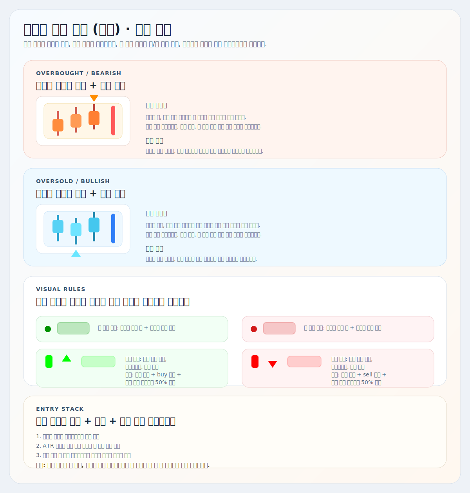
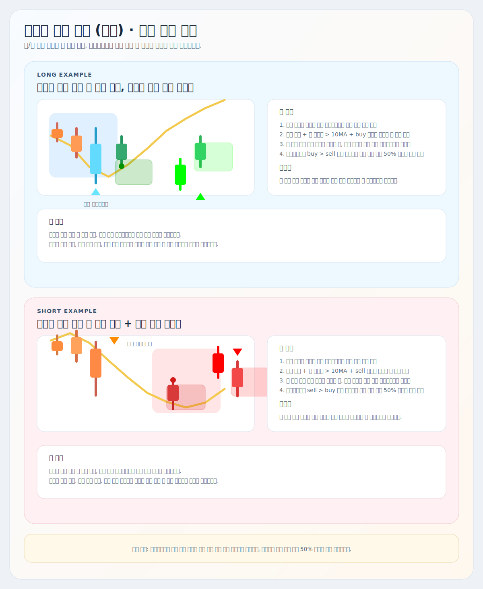

# 비정상 가격 추적 (캔들)

트레이딩뷰용 Pine Script 오버레이 지표 설명서입니다.

대상 스크립트:
- [`abnormal-price-tracker-candles.pine`](./abnormal-price-tracker-candles.pine)

## 한눈에 보기

이 지표는 `자리`, `체결`, `후속 진행`을 한 장에 겹쳐서 보는 용도입니다.

- 비정상 캔들: `cRSI 극단 + 볼린저 몸통 이탈`
- RSI 다이버전스 + 피벗 기준봉 박스
- ATR 배경 구간
- `롱/숏 진입 후보` 신호
- 유동성 스윕 봉과 다음 봉 다이아몬드 확인
- 과거 박스 유지 옵션

배경 판단에는 내부적으로 아래 계산도 반영됩니다.

- 거래량 압력 종합 신호
- 보조 종합 신호(MFI + cRSI 갭, 가격 확장, 거래량)

## 예시 화면

## 주요 기능

| 기능 | 핵심 의미 | 주요 설정 |
| --- | --- | --- |
| 이동평균선 | 기준 MA 위/아래를 색으로 구분합니다. | `이동평균 기간`, `평균 기준 가격` |
| 비정상 캔들 | 과열/투매성 봉을 색으로 강조합니다. | `비정상 캔들 볼린저 기간/배수`, `몸통 초과 비율` |
| RSI 다이버전스 | 피벗 확정 후 강세/약세 효율 저하를 표시합니다. | `RSI 기간`, `Pivot Left/Right`, `다이버전스 기준봉 존 표시` |
| ATR 배경 | 이상 신호 뒤 실제 후속 이동이 붙었는지 보여줍니다. | `ATR 기간`, `ATR 배수`, `강한 배경 배수` |
| 롱/숏 진입 후보 | 점수, 거래량, 배경 순서를 합쳐 최종 진입 후보를 만듭니다. | `최소 진입 점수`, `진입 후보 점수`, `총 거래량 MA 기준 봉 수` |
| 유동성 스윕 | 기존 박스를 실제로 쓸고 간 봉과 다음 봉 확인을 표시합니다. | `유동성 스윕 봉 색상 표시`, `스윕 확인 최소 거래량 비율` |
| 박스 유지 | 과거 진입 후보/다이버전스/스윕 박스를 더 오래 남깁니다. | `과거 박스 모두 유지` |

## 알림 단계

초보자는 아래 순서대로만 읽으면 됩니다.

| 단계 | 의미 | 대표 알림 |
| --- | --- | --- |
| 0단계 | 자리가 만들어지기 시작함 | `롱 자리 (과매도 시작) - 하단 이탈`, `숏 자리 (과매수 시작) - 상단 이탈` |
| 1단계 | 힘이 약해지는 힌트가 나옴 | `롱 힌트 (하락 힘 약해짐) - 강세 다이버전스`, `숏 힌트 (상승 힘 약해짐) - 약세 다이버전스` |
| 2단계 | 실제 감시할 배경 구간이 형성됨 | `롱 감시 (매수 배경 진입) - ATR 배경`, `숏 감시 (매도 배경 진입) - ATR 배경` |
| 3단계 | 첫 진입 신호가 나옴 | `롱 진입 후보 (첫 진입 신호) - 종합 기준 통과`, `숏 진입 후보 (첫 진입 신호) - 종합 기준 통과` |
| 4단계 | 유동성 스윕 뒤 확인까지 끝남 | `롱 확인 (하단 유동성 스윕) - 확인 봉`, `숏 확인 (상단 유동성 스윕) - 확인 봉` |

중요도는 `다이버전스 < 배경 < 롱/숏 진입 후보 < 유동성 스윕` 순서로 해석합니다.
비정상 캔들은 0단계의 `자리 경고`로 보고, 그 위에 단계가 쌓이는지 확인하면 됩니다.

## 해석 순서

1. 비정상 캔들이 있는지 먼저 봅니다.
2. 같은 구간에 RSI 다이버전스가 붙는지 확인합니다.
3. ATR 배경이 켜지면서 후속 진행이 붙는지 봅니다.
4. `롱/숏 진입 후보`가 뜨면 첫 진입 후보로 해석합니다.
5. 이후 박스를 스윕한 봉이 나오면 다음 봉 다이아몬드로 재확인을 기다립니다.

## 표시 규칙

진입 후보와 다이버전스는 어두운 톤으로, 스윕 확인은 더 밝은 톤으로 구분해서 겹쳐 보여도 빠르게 식별할 수 있게 설계했습니다.

| 표시 | 의미 |
| --- | --- |
| 주황/하늘 비정상 캔들 | 과열 분출 또는 투매 분출 자리 |
| 어두운 녹색/빨강 동그라미 | `롱 진입 후보 / 숏 진입 후보` 첫 진입 후보 |
| 어두운 녹색/빨강 박스 | 진입 후보 신호봉 기준 박스 |
| 채도 낮은 청록/갈주황 삼각형 | 강세/약세 다이버전스 |
| 밝은 초록/빨강 몸통 | 박스를 실제로 쓸고 간 스윕 봉 |
| 밝은 초록/빨강 다이아몬드 | 스윕 다음 봉 재확인 |

## 박스 기준

- 롱 진입 후보 박스: `저가 ~ 종가`
- 숏 진입 후보 박스: `고가 ~ 종가`
- 강세 다이버전스 박스: `저가 ~ 시가`
- 약세 다이버전스 박스: `고가 ~ 시가`
- 스윕 확인 박스: 다이아몬드가 생성된 `다음 확인 봉` 기준

## 다이아몬드 조건

다이아몬드는 스윕 다음 봉이 아래 조건을 만족할 때만 생성됩니다.

- 롱 계열:
  - 다음 봉 `양봉`
  - `buyVolume > sellVolume`
  - `다음 봉 거래량 >= 이전 스윕 봉 거래량 * 스윕 확인 최소 거래량 비율`
- 숏 계열:
  - 다음 봉 `음봉`
  - `sellVolume > buyVolume`
  - `다음 봉 거래량 >= 이전 스윕 봉 거래량 * 스윕 확인 최소 거래량 비율`

기본값은 `0.5`입니다.

## 실전 해석

### 롱 쪽

- `비정상 과매도 + 강세 다이버전스 + 강세 배경`이 겹치면 바닥 흡수 후보로 봅니다.
- `롱 진입 후보`는 첫 진입 후보입니다.
- 이후 롱 진입 후보 박스나 강세 다이버전스 박스를 아래로 한 번 스윕하고, 다음 봉에 밝은 초록 다이아몬드가 나오면 재확인 후보로 봅니다.

### 숏 쪽

- `비정상 과매수 + 약세 다이버전스 + 약세 배경`이 겹치면 상단 분산 후보로 봅니다.
- `숏 진입 후보`는 첫 진입 후보입니다.
- 이후 숏 진입 후보 박스나 약세 다이버전스 박스를 위로 한 번 스윕하고, 다음 봉에 밝은 빨강 다이아몬드가 나오면 재확인 후보로 봅니다.

## 전략 예시

## 자주 보는 옵션

- `총 거래량 MA 기준 봉 수`
- `스윕 확인 최소 거래량 비율`
- `과거 박스 모두 유지`
- `롱/숏 진입 후보 동그라미 색상`
- `강세/약세 다이버전스 삼각형 색상`
- `강세/약세 스윕 다이아몬드/봉 색상`
- `롱/숏 기준봉 존 색상`
- `강세/약세 다이버전스 존 색상`

## 알람

주요 알람은 아래 순서로 해석합니다.

- `0단계 롱 자리 (과매도 시작) - 하단 이탈`
- `0단계 숏 자리 (과매수 시작) - 상단 이탈`
- `0단계 롱 자리 유지 (과매도 계속) - 하단 유지`
- `0단계 숏 자리 유지 (과매수 계속) - 상단 유지`
- `1단계 롱 힌트 (하락 힘 약해짐) - 강세 다이버전스`
- `1단계 숏 힌트 (상승 힘 약해짐) - 약세 다이버전스`
- `2단계 롱 감시 (매수 배경 진입) - ATR 배경`
- `2단계 숏 감시 (매도 배경 진입) - ATR 배경`
- `2단계 롱 감시 강화 (매수 배경 강화) - ATR 확장`
- `2단계 숏 감시 강화 (매도 배경 강화) - ATR 확장`
- `3단계 롱 진입 후보 (첫 진입 신호) - 종합 기준 통과`
- `3단계 숏 진입 후보 (첫 진입 신호) - 종합 기준 통과`
- `4단계 롱 확인 (하단 유동성 스윕) - 확인 봉`
- `4단계 숏 확인 (상단 유동성 스윕) - 확인 봉`

## 주의사항

- 자동매매 전략이 아니라 해석 보조 지표입니다.
- 다이버전스는 피벗 확정 뒤에 표시됩니다.
- 롱/숏 진입 후보도 상위 추세 반대면 짧은 반등/반락으로 끝날 수 있습니다.
- 과거 박스 유지 옵션을 켜면 예전 박스도 남지만, TradingView 한계상 전체 박스 수는 약 `500개` 안에서 관리됩니다.
- 진입 기준보다 `무효화 기준`을 먼저 정해두는 편이 안전합니다.
