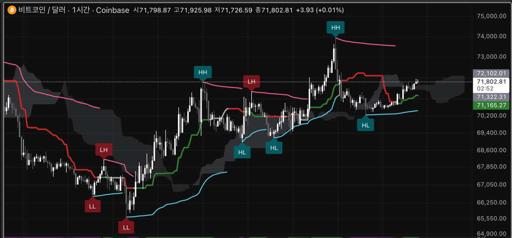
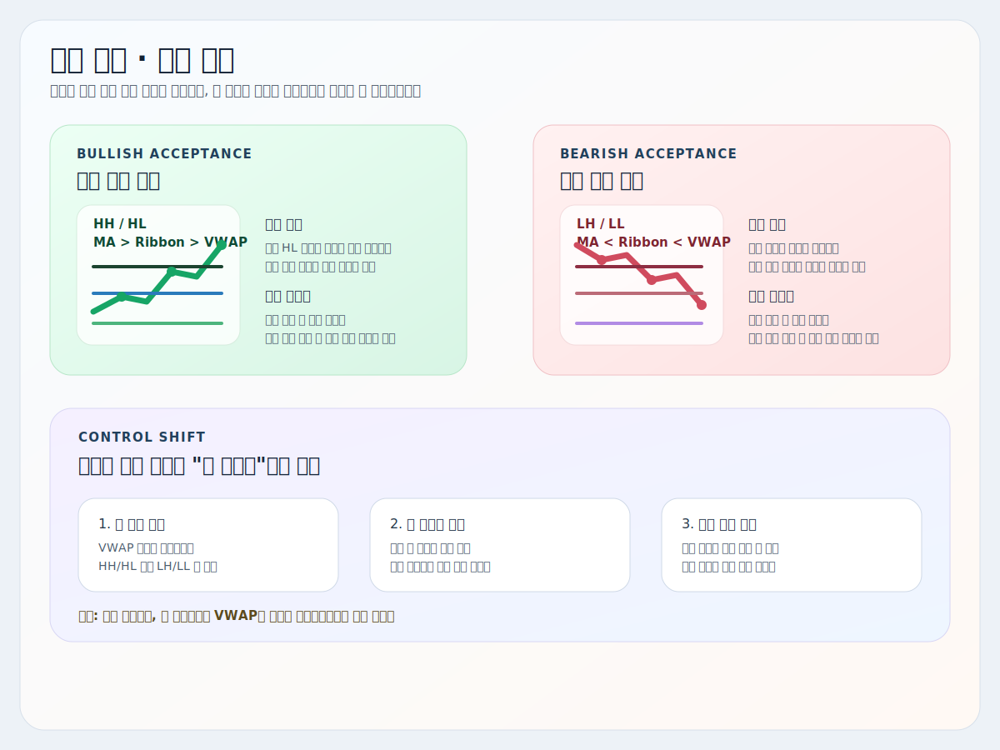

# 추세 추적

트레이딩뷰에서 사용할 수 있는 Pine Script 지표 설명서입니다.

대상 스크립트:
- [`trend-tracker.pine`](./trend-tracker.pine)

## 개요

이 지표는 차트 위에 스윙 고점/저점을 기준으로 다시 계산되는 적응형 VWAP 라인을 그려서, 현재 추세의 기준 가격대를 시각적으로 추적할 수 있도록 만든 오버레이 스크립트입니다.

여기에 이동평균 리본(20~50, 선택형 100/200)과 단기 시그널 이동평균-리본-VWAP의 정렬 상태까지 함께 표시해서, 단순 가격 위치가 아니라 추세 구조와 평균 가격대 정렬 상태를 한 화면에서 확인할 수 있도록 구성되어 있습니다.

## 사용 지표

이 스크립트는 아래 지표를 조합해서 추세를 봅니다.

- `Dynamic Swing Anchored VWAP`
- `Moving Average Ribbon (20/25/30/35/40/45/50 + 100/200)`
- `Signal Moving Average`
- `HH / HL / LH / LL` 스윙 구조 라벨

## 트레이딩뷰 적용 방법

1. 트레이딩뷰에서 `Pine Editor`를 엽니다.
2. [`trend-tracker.pine`](./trend-tracker.pine) 파일의 전체 내용을 복사합니다.
3. Pine Editor에 붙여넣습니다.
4. `Add to chart` 또는 `차트에 추가`를 클릭합니다.
5. 필요하면 `Save`로 개인 스크립트로 저장합니다.

## 예시 화면

위 예시 화면에서는 아래 요소를 확인할 수 있습니다.

- 스윙 라벨: 최근 스윙 구조를 기준으로 표시되는 `HH`, `HL`, `LH`, `LL`
- 컬러 VWAP 라인: 스윙 전환 이후 다시 추적되는 적응형 VWAP
- 이동평균 리본: `20~50` 구간의 추세 압축/확산 상태
- 장기 리본: 선택적으로 표시되는 `MA 100`, `MA 200`과 그 사이 fill
- 배경색: `Signal MA > Ribbon > VWAP` 또는 `Signal MA < Ribbon < VWAP` 정렬 상태

즉, 현재 가격이 어디에 있는지만 보는 것이 아니라, 스윙 구조와 여러 평균 가격선들의 상대적 배열이 추세 방향과 맞게 정렬되어 있는지도 함께 볼 수 있습니다.

## 이미지에서 어떻게 보는지

이미지에서 이 지표는 `먼저 방향을 정하는 기준`입니다.

- `HH/HL`이 이어지면 상승 추세 우선입니다.
- `LH/LL`이 이어지면 하락 추세 우선입니다.
- 가격이 VWAP와 리본 위에서 움직이고, 배경까지 강세 정렬이면 롱 시나리오를 먼저 봅니다.
- 가격이 VWAP와 리본 아래에서 움직이고, 배경까지 약세 정렬이면 숏 시나리오를 먼저 봅니다.

핵심은 이 지표 하나로 진입을 끝내는 것이 아니라, `오늘은 롱 우선인지 숏 우선인지`를 먼저 정하는 데 있습니다.

## 기본 정보

- Pine Script 버전: `@version=6`
- 표시 위치: `overlay=true`
- 지표명: `Dynamic Swing Anchored VWAP (Zeiierman) + MA Ribbon + Alignment`

## 현재 기본 세팅

이 스크립트는 현재 `나스닥 1시간봉 추세 추적` 기준 기본값으로 맞춰져 있습니다.

- `Swing Period`: `14`
- `Adaptive Price Tracking`: `28`
- `Adapt APT by ATR ratio`: `true`
- `Volatility Bias`: `1.4`
- `Ribbon Source`: `close`
- `Exponential`: `true`
- `MA 100`: `true`
- `MA 200`: `true`
- `MA Length`: `9`
- `Show Ribbon`: `true`

1시간봉에서 추세 전환을 너무 늦게 보지 않으면서도, 정렬 판단에 쓰는 단기 `9` 시그널 이동평균과 `20~50` 리본이 함께 추세 구조를 보여주도록 맞춘 설정입니다. 장기 `100/200` 리본도 기본적으로 켜 두어 큰 흐름까지 함께 확인할 수 있습니다.

## 주요 기능

| 기능 | 핵심 의미 | 주요 설정/조건 |
| --- | --- | --- |
| 스윙 포인트 탐지 | 최근 구조를 `HH / HL / LH / LL`로 표시해 방향성을 먼저 분류합니다. | `Swing Period` |
| Dynamic Swing Anchored VWAP | 스윙 전환 시점마다 기준 가격을 다시 잡아 평균 체결 단가 흐름을 추적합니다. | `Adaptive Price Tracking`, `Adapt APT by ATR ratio`, `Volatility Bias` |
| Moving Average Ribbon | 단기~중기 평균선이 한 방향으로 정렬되는지와 압축/확산을 보여줍니다. | `Show Ribbon`, `Source`, `Exponential`, `MA 100`, `MA 200` |
| Alignment 배경 | 시그널 MA, 리본, VWAP 배열이 정돈됐는지 확인합니다. | 강세: `Signal MA > MA20 > ... > MA50 > VWAP`, 약세: `Signal MA < MA20 < ... < MA50 < VWAP` |

짧게 보면:

- 스윙 라벨은 `구조`
- VWAP는 `평균 단가`
- 리본은 `평균 가격대의 방향과 압축/확산`
- 배경은 `정렬 상태`

## 추천 사용 흐름

1. 먼저 최근 스윙 라벨이 `HH/HL` 구조인지 `LH/LL` 구조인지 확인합니다.
2. 현재 가격이 적응형 VWAP 위에 있는지 아래에 있는지 봅니다.
3. 리본이 위로 벌어지는지, 아래로 벌어지는지, 또는 서로 뭉쳐 있는지 확인합니다.
4. 배경색이 켜져 있으면 Signal MA-리본-VWAP 정렬이 맞는지 해석합니다.
5. 정렬과 스윙 구조가 같은 방향이면 추세 지속 후보로, 어긋나면 조정 또는 전환 가능성으로 봅니다.

이 지표는 단일 진입 신호를 주기보다, 추세 구조와 기준 가격 정렬 상태를 종합적으로 해석하는 데 더 적합합니다.

## 세력 관점 해석

이 지표는 `대형 참여자의 평균 체결 단가가 어느 방향으로 이동하는지`를 읽는 데 가장 가깝습니다.

### 1. `HH/HL + 가격이 VWAP/리본 위 + 강세 정렬`

이 조합은 시장이 더 높은 가격을 `받아들이고 있다`는 뜻에 가깝습니다.

- 눌림이 와도 이전 `HL` 위에서 받는 흐름이 반복되면, 큰 자금이 평균 단가를 위로 옮기며 보유를 늘리는 구간일 수 있습니다.
- 적응형 VWAP 위에서 가격이 계속 안착하면 `비싸도 사는 쪽`이 우위라는 의미로 해석할 수 있습니다.
- 이때 예상되는 움직임은 `얕은 눌림 -> 재상승 -> 고점 재시험`입니다.

즉 세력 관점에서는 `아래에서 모아서 위로 마크업(markup)하는 단계`일 가능성을 먼저 봅니다.

### 2. `LH/LL + 가격이 VWAP/리본 아래 + 약세 정렬`

이 조합은 시장이 더 낮은 가격을 `정상 가격`으로 받아들이는 구간에 가깝습니다.

- 반등이 나와도 `LH` 아래에서 다시 눌리면, 위로 팔 물량이 계속 남아 있는 구조일 수 있습니다.
- 가격이 적응형 VWAP 아래에서 머물수록 평균 단가가 아래로 이동하며 `반등 매도`가 잘 먹히는 구간일 가능성이 높습니다.
- 이때 예상되는 움직임은 `짧은 반등 -> 재하락 -> 저점 재시험`입니다.

즉 세력 관점에서는 `위에서 덜어내며 아래로 마크다운(markdown)하는 단계`를 의심합니다.

### 3. 스윙 전환 직후 적응형 VWAP가 새로 잡힐 때

이 구간은 `주도권 교체 후보`입니다.

- `HH/HL` 쪽으로 새 스윙이 잡히고 VWAP 기준이 위로 재설정되면, 하락 주도권이 끝나고 `새 매집 평균가`가 형성되는 초기 단계일 수 있습니다.
- 반대로 `LH/LL` 쪽으로 스윙이 꺾이며 VWAP 기준이 아래로 재설정되면, 이전 상승 구간의 평균 매수자들이 불리해지며 `분산/청산` 구간으로 넘어갈 수 있습니다.

여기서 중요한 것은 `첫 전환`보다 `첫 되돌림에서 리본 하단/상단이 지켜지는지`입니다.

- 첫 되돌림에서 리본 위를 유지하면 `추세 수용`
- 첫 되돌림에서 바로 이탈하면 `가짜 전환` 가능성

### 4. 구조와 정렬이 어긋날 때

이 구간은 진짜로 어려운 자리이고, 가장 자주 함정이 나오는 자리입니다.

- `HH/HL`인데 배경 정렬이 약하거나 사라지면, 위로 올리긴 했지만 내부 평균 단가 정렬이 따라오지 않는 `후반 추세` 또는 `분산`일 수 있습니다.
- `LH/LL`인데 약세 정렬이 약해지면, 아래로 밀어도 평균 단가 하향 정렬이 흐트러져 `숏 커버` 또는 `바닥 흡수` 가능성을 같이 봐야 합니다.
- 리본이 서로 강하게 압축된 상태에서 스윙이 자주 바뀌면 대형 자금도 방향을 밀기보다 `양방향 체결을 소화하는 경매 구간`일 수 있습니다.

이런 자리에서는 `추세 확정`보다 `다음 확인 신호 대기`가 우선입니다.

### 5. 이 지표로 예측할 수 있는 움직임

확정 예언이 아니라, 아래 같은 `가능성 높은 후속 행동`을 예측하는 용도입니다.

- 강세 구조 유지: 눌림 뒤 고점 재시험 가능성 증가
- 약세 구조 유지: 반등 뒤 저점 재시험 가능성 증가
- 첫 구조 전환: 추세 반전 시도 또는 가짜 돌파 시작
- 정렬 약화: 추세 둔화, 분산, 숏 커버, 롱 청산 가능성 증가
- 리본 압축 구간 혼전: 관망 또는 짧은 단기 대응 구간

## 거래 예시

### 롱 예시

- 최근 스윙 라벨이 `HH -> HL -> HH` 식으로 이어집니다.
- 가격이 적응형 VWAP 위에 있고, 리본도 위에서 지지처럼 작동합니다.
- 배경이 강세 정렬로 유지되면 `상승 추세 안 눌림 매수` 시나리오를 먼저 준비합니다.
- 이후 보조 지표에서 `Bear` 라벨, 캔들 지표에서 과매도/강세 다이버전스, 거래량 지표에서 비정상 매수 거래량이 붙으면 롱 후보로 연결합니다.

### 숏 예시

- 최근 스윙 라벨이 `LL -> LH -> LL` 식으로 이어집니다.
- 가격이 적응형 VWAP 아래에 있고, 리본도 아래에서 저항처럼 작동합니다.
- 배경이 약세 정렬로 유지되면 `하락 추세 안 반등 매도` 시나리오를 먼저 준비합니다.
- 이후 보조 지표에서 `Bull` 라벨, 캔들 지표에서 과매수/약세 다이버전스, 거래량 지표에서 비정상 매도 거래량이 붙으면 숏 후보로 연결합니다.

이 지표로 방향을 먼저 정해두면, 나머지 3개 지표는 그 방향의 눌림과 체결 강도를 확인하는 용도로 훨씬 쓰기 쉬워집니다.

## 실전 롱/숏 전략 예시

### 롱 기준

- `롱 매수`: `HH/HL` 구조와 강세 정렬이 유지된 상태에서, 첫 `HL` 지지 확인 봉이 나올 때 진입합니다.
- `롱 매도`: 직전 `HH` 재시험 구간이나 상단 저항 구간에서 청산합니다.
- `무효화`: `HL` 저점 아래로 다시 밀리거나, 리본/VWAP 아래로 재안착하면 시나리오를 버립니다.

### 숏 기준

- `숏 매도`: `LH/LL` 구조와 약세 정렬이 유지된 상태에서, 첫 `LH` 저항 확인 봉이 나올 때 진입합니다.
- `숏 매수`: 직전 `LL` 재시험 구간이나 하단 지지 구간에서 청산합니다.
- `무효화`: `LH` 고점 위로 다시 안착하거나, 리본/VWAP 위로 복귀하면 시나리오를 버립니다.

### 이 지표를 쓸 때 중요한 점

- 추세 추적은 `방향을 정하는 지표`이지, 단독 진입 지표가 아닙니다.
- 가장 좋은 자리는 `첫 HL`, `첫 LH`처럼 구조가 다시 확인되는 자리입니다.
- 진입보다 먼저 `HL/LH가 깨지면 바로 나간다`는 기준을 정해야 실수가 줄어듭니다.

## 주의사항

- 스윙 포인트는 `Swing Period` 값에 따라 민감도가 크게 달라집니다.
- 적응형 VWAP는 일반 고정 VWAP와 다르게 스윙 전환 시점마다 기준이 다시 설정됩니다.
- 배경색 정렬은 Signal MA, 리본, VWAP의 상대적 위치를 보여주는 보조 해석용 신호입니다.
- 횡보 구간에서는 스윙 전환과 정렬 신호가 잦아져 해석 난도가 높아질 수 있습니다.
- 현재 기본값은 `초단타`보다 `스윙 추세 확인`에 맞춘 값이므로, 매우 짧은 타임프레임에서는 반응이 느리게 느껴질 수 있습니다.
- `HH/HL`이나 `LH/LL` 하나만 보고 바로 추세 확정으로 단정하지 말고, 첫 되돌림 유지 여부까지 같이 확인해야 합니다.
